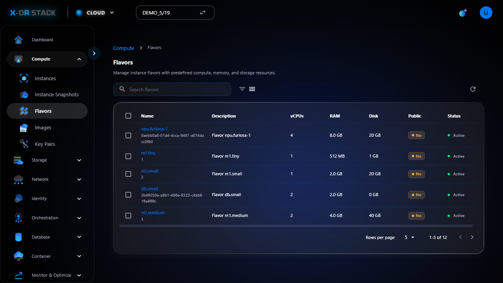

# 🔹 Flavors

## 📝 Giới thiệu
Flavors định nghĩa cấu hình phần cứng (CPU, RAM, ổ cứng) cho instance. Bạn cần chọn flavor phù hợp khi tạo máy ảo.

## 📸 Hướng dẫn từng bước

### 🔸 Bước 1: 01 list

_👉 Mô tả: Đây là bước "01 list". Hãy đối chiếu hình ảnh và thực hiện đúng thao tác._

---
[⬅️ Quay lại trang chính](compute-doc.md)
