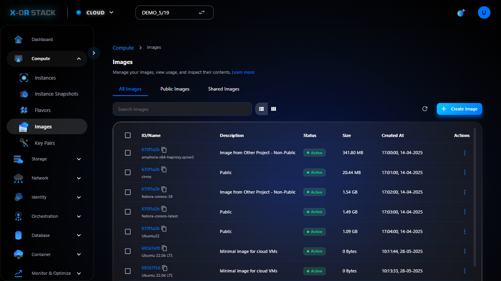

# 🔹 Images

## 📝 Giới thiệu
Images là các bản cài đặt hệ điều hành (như Ubuntu, CentOS, Windows) hoặc template phần mềm dùng để tạo instance.

## 📸 Hướng dẫn từng bước

### 🔸 Bước 1: 01 images list

_👉 Mô tả: Đây là bước "01 images list". Hãy đối chiếu hình ảnh và thực hiện đúng thao tác._

### 🔸 Bước 2: 02 create form

_👉 Mô tả: Đây là bước "02 create form". Hãy đối chiếu hình ảnh và thực hiện đúng thao tác._

### 🔸 Bước 3: 03 done

_👉 Mô tả: Đây là bước "03 done". Hãy đối chiếu hình ảnh và thực hiện đúng thao tác._

---
[⬅️ Quay lại trang chính](compute-doc.md)
