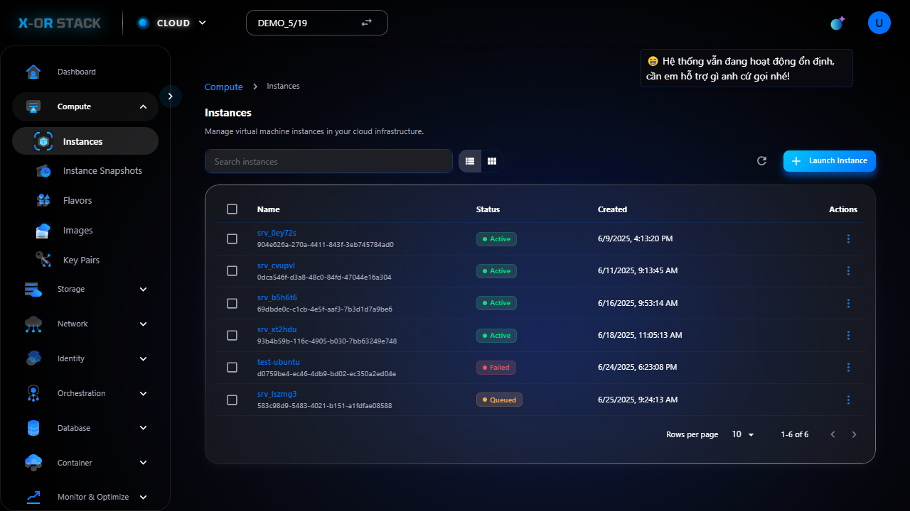
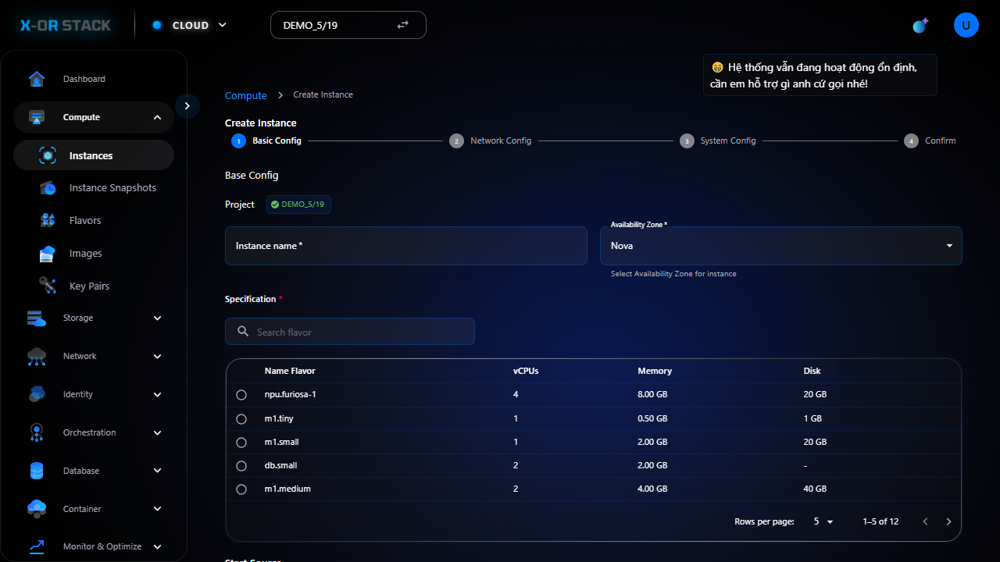
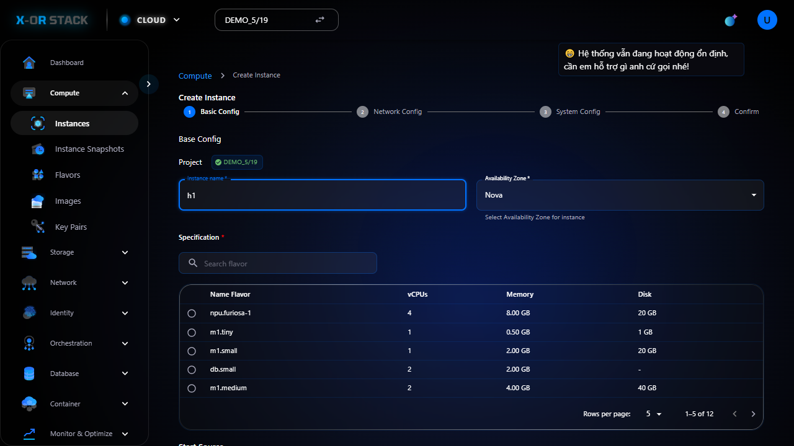
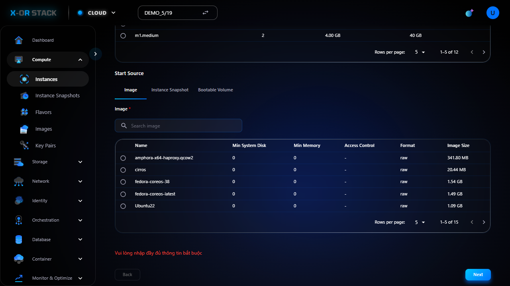

# 🔹 Instances

## 📝 Giới thiệu
Instances là các máy ảo (Virtual Machines - VMs) dùng để chạy ứng dụng hoặc dịch vụ trên nền tảng đám mây.

## 📸 Hướng dẫn từng bước

### 🔸 Bước 1: 01 instances list

_👉 Mô tả: Đây là bước "01 instances list". Hãy đối chiếu hình ảnh và thực hiện đúng thao tác._

### 🔸 Bước 2: 02 create form

_👉 Mô tả: Đây là bước "02 create form". Hãy đối chiếu hình ảnh và thực hiện đúng thao tác._

### 🔸 Bước 3: 03 filled form

_👉 Mô tả: Đây là bước "03 filled form". Hãy đối chiếu hình ảnh và thực hiện đúng thao tác._

### 🔸 Bước 4: 04 done

_👉 Mô tả: Đây là bước "04 done". Hãy đối chiếu hình ảnh và thực hiện đúng thao tác._

---
[⬅️ Quay lại trang chính](compute-doc.md)
