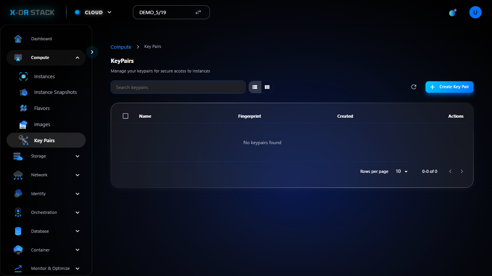

# 🔹 Key Pairs

## 📝 Giới thiệu
Key Pairs là cặp khóa bảo mật (public/private key) dùng để đăng nhập vào instance qua SSH. Bạn cần tạo và tải về khóa cá nhân.

## 📸 Hướng dẫn từng bước

### 🔸 Bước 1: 01 list

_👉 Mô tả: Đây là bước "01 list". Hãy đối chiếu hình ảnh và thực hiện đúng thao tác._

---
[⬅️ Quay lại trang chính](compute-doc.md)
