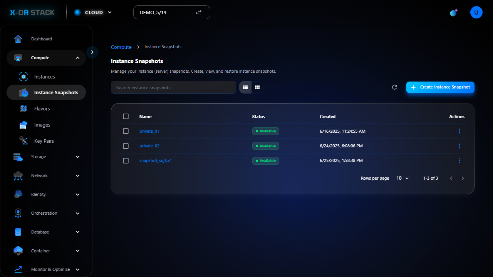

# 🔹 Snapshots

## 📝 Giới thiệu
Snapshots là bản sao lưu của instance tại một thời điểm cụ thể. Dùng để khôi phục hoặc tạo image mới khi cần.

## 📸 Hướng dẫn từng bước

### 🔸 Bước 1: 01 snapshots list

_👉 Mô tả: Đây là bước "01 snapshots list". Hãy đối chiếu hình ảnh và thực hiện đúng thao tác._

### 🔸 Bước 2: 02 create form

_👉 Mô tả: Đây là bước "02 create form". Hãy đối chiếu hình ảnh và thực hiện đúng thao tác._

---
[⬅️ Quay lại trang chính](compute-doc.md)
