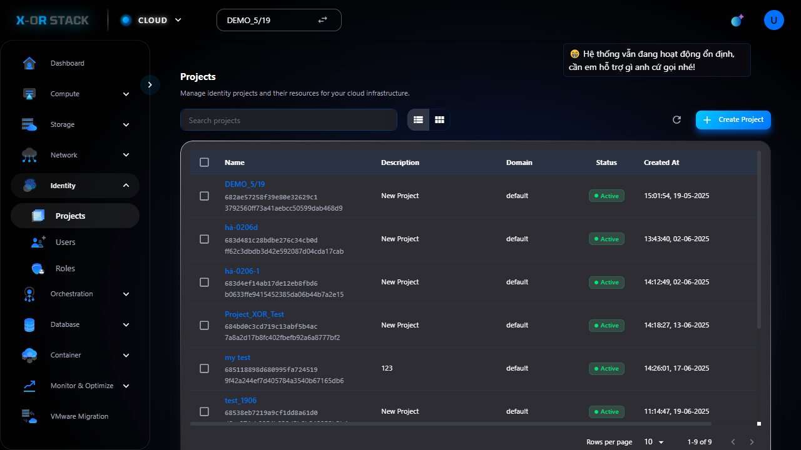
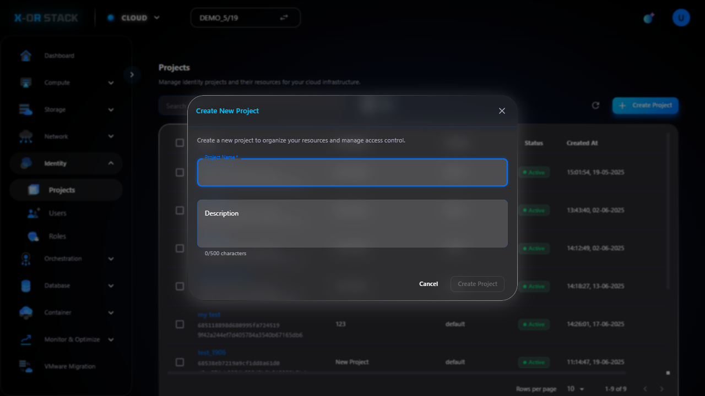

# Quản lý Projects (Dự án)

## Giới thiệu
Chức năng **Projects** trong module **Identity** cho phép tạo các dự án để tổ chức và phân quyền tài nguyên cho người dùng.

## Các bước thao tác

### 1. Truy cập Projects
- Từ menu chính chọn `Identity > Projects`.
- Giao diện hiển thị danh sách các project hiện có.

### 2. Tạo Project mới
- Nhấn nút `Create Project`.
- Nhập:
  - **Name**: project-demo
  - **Description**: Demo project for testing
- Bấm `Create`.

## Đường dẫn thao tác
`https://portal.stack-dev.x-or.cloud/identity/projects`