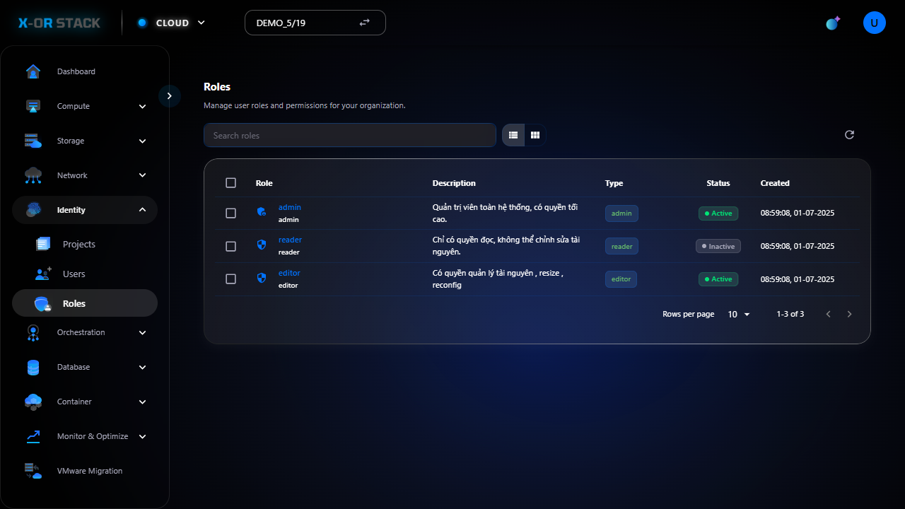

# Quản lý Roles (Vai trò)

## Giới thiệu
Chức năng **Roles** trong module **Identity** cho phép định nghĩa các vai trò và quyền hạn để phân cho người dùng theo từng dự án.

## Các bước thao tác

### 1. Truy cập Roles
- Từ menu chính chọn `Identity > Roles`.
- Giao diện hiển thị danh sách các vai trò.

### 2. Tạo Role mới
- Nhấn nút `Create Role`.
- Nhập:
  - **Name**: role-demo
  - **Description**: Demo role for testing
- Bấm `Create`.

## Đường dẫn thao tác
`https://portal.stack-dev.x-or.cloud/identity/roles`