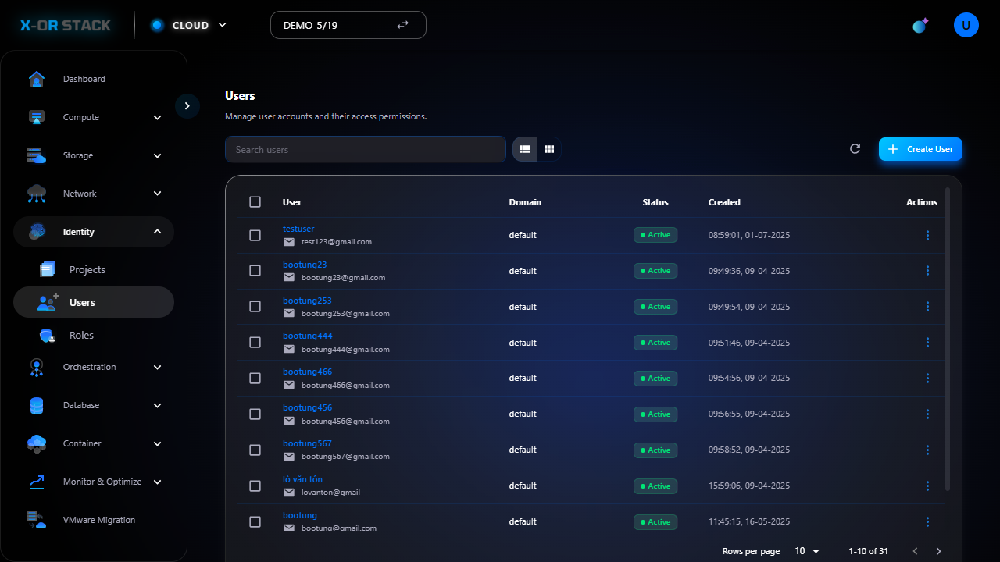
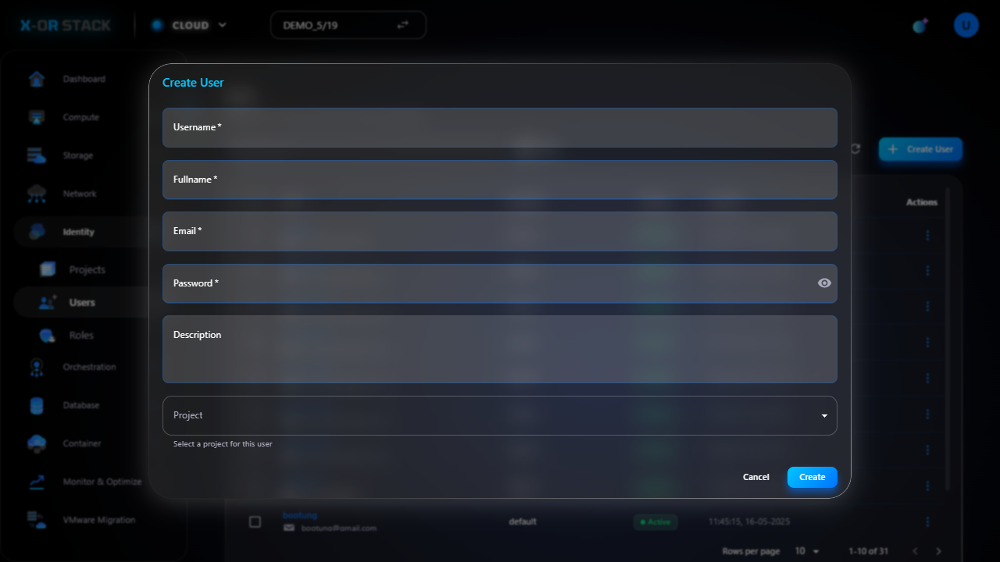

# Quản lý Users (Người dùng)

## Giới thiệu
Chức năng **Users** trong module **Identity** cho phép tạo người dùng mới và phân quyền sử dụng tài nguyên.

## Các bước thao tác

### 1. Truy cập Users
- Từ menu chính chọn `Identity > Users`.
- Giao diện hiển thị danh sách người dùng hiện có.

### 2. Tạo User mới
- Nhấn `Create User`.
- Nhập:
  - **Username**: demo-user
  - **Email**: demo@example.com
  - **Password** và xác nhận: `123456`
- Bấm `Create`.

### 3. User được tạo thành công

## Đường dẫn thao tác
`https://portal.stack-dev.x-or.cloud/identity/users`