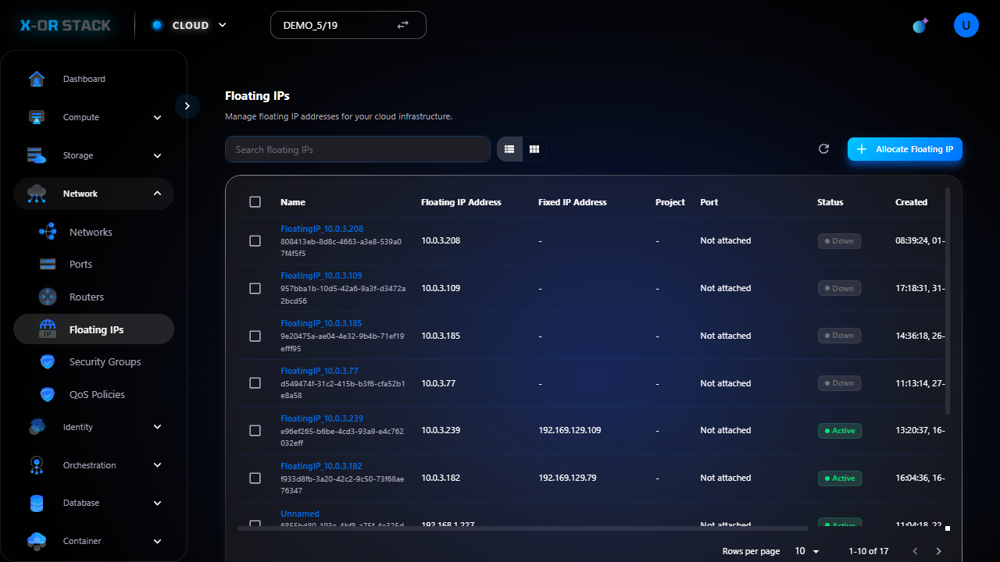

# Quản lý Floating IPs (IP công cộng)

## Giới thiệu
**Floating IP** là địa chỉ IP công cộng dùng để ánh xạ vào máy ảo (instance) đang chạy trong private network.

## Các bước thao tác

### 1. Truy cập Floating IPs
- Từ menu chính chọn `Network > Floating IPs`.
- Giao diện hiển thị danh sách IP hiện có.

### 2. Cấp phát Floating IP
- Nhấn `Allocate Floating IP`.
- Chọn:
  - **Pool**: Mạng public
            
- Bấm `Allocate`.

### 3. Gán Floating IP vào Instance
- Chọn Floating IP vừa tạo → `Associate`.
- Chọn instance/port cần gán.

## Ghi chú
- Mỗi IP chỉ gán được cho 1 port tại 1 thời điểm.
- Gán IP giúp instance truy cập Internet hoặc được SSH từ ngoài.

## Đường dẫn thao tác
`https://portal.stack-dev.x-or.cloud/network/floating_ips`