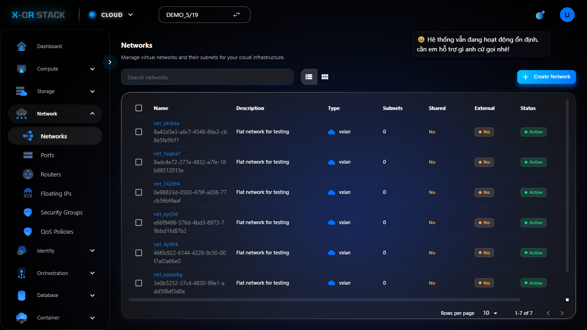
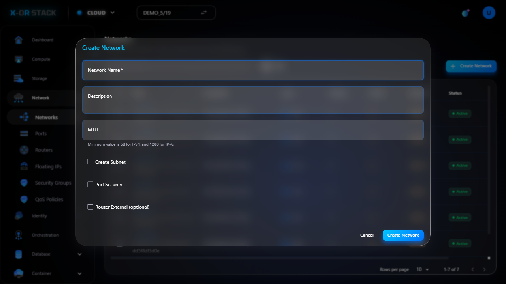

# Quản lý Networks (Mạng nội bộ)

## Giới thiệu
Chức năng **Networks** trong module **Network** cho phép người dùng tạo và quản lý các mạng nội bộ (private networks) dùng để kết nối giữa các máy ảo.

## Các bước thao tác

### 1. Truy cập Networks
- Từ menu chính chọn `Network > Networks`.
- Giao diện hiển thị danh sách các mạng hiện có.

### 2. Tạo Network mới
- Nhấn nút `Create Network`.
- Nhập thông tin:
  - **Name**: Tên mạng (ví dụ: `network-demo`)
  - **CIDR**: Dải mạng, ví dụ `192.168.100.0/24`
  - **Gateway IP**: IP cổng, ví dụ `192.168.100.1`
- Bấm `Create`.

### 3. Network đã được tạo thành công

## Ghi chú
- CIDR và Gateway IP cần không trùng với các mạng đang có.
- Sau khi tạo có thể dùng để gán cho Instance hoặc Router.

## Đường dẫn thao tác
`https://portal.stack-dev.x-or.cloud/network/networks`