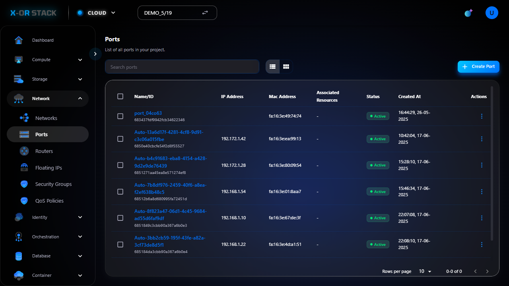
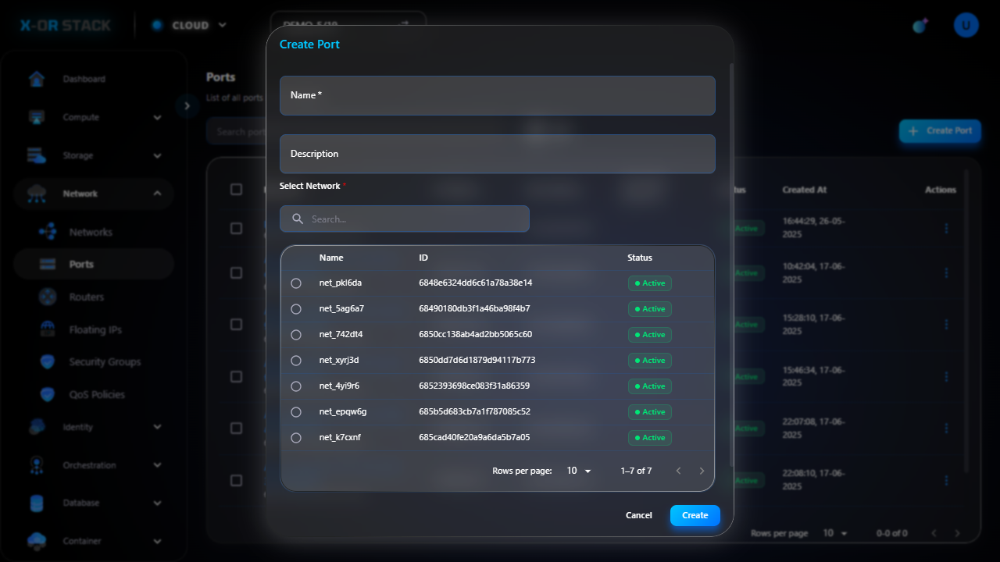

# Quản lý Ports (Cổng mạng)

## Giới thiệu
Chức năng **Ports** trong module **Network** cho phép tạo và quản lý các cổng mạng (port) kết nối giữa instance và network.

## Các bước thao tác

### 1. Truy cập Ports
- Từ menu chính chọn `Network > Ports`.
- Giao diện hiển thị danh sách các port hiện có.

### 2. Tạo Port mới
- Nhấn nút `Create Port`.
- Nhập thông tin:
  - **Name**: Tên port (ví dụ: `port-demo`)
  - **Network**: Chọn mạng kết nối (ví dụ: `network-demo`)
- Bấm `Create`.

## Ghi chú
- Mỗi port đại diện cho một interface mạng.
- Có thể gắn port này vào instance hoặc router.

## Đường dẫn thao tác
`https://portal.stack-dev.x-or.cloud/network/ports`