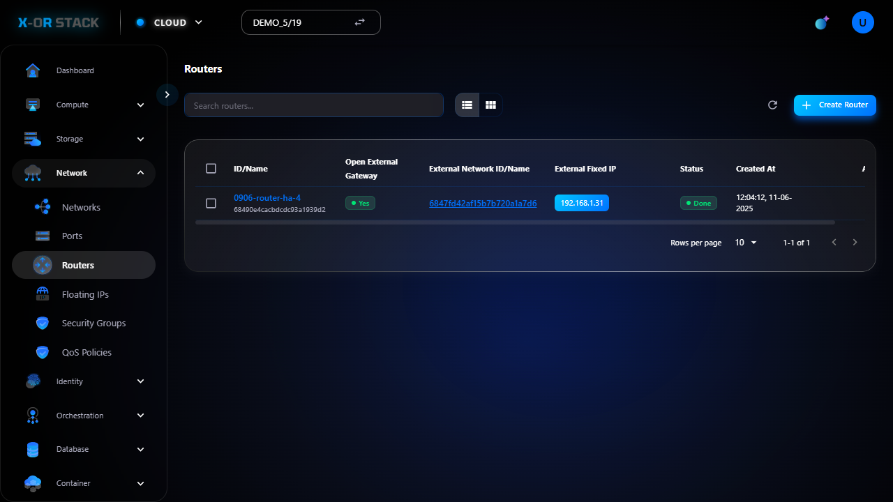
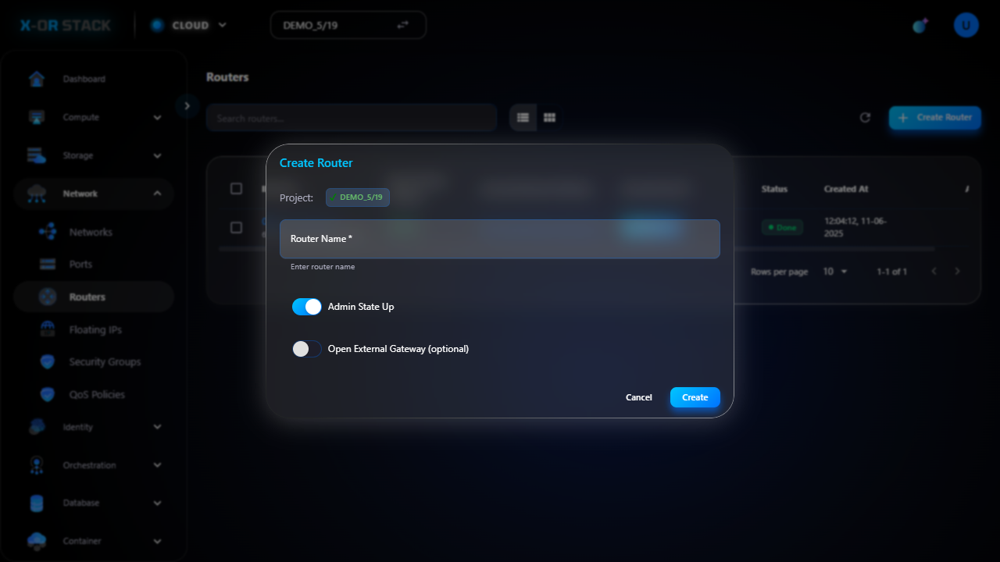

# Quản lý Routers (Bộ định tuyến)

## Giới thiệu
Chức năng **Routers** trong module **Network** cho phép định tuyến lưu lượng giữa các mạng nội bộ và internet/public network.

## Các bước thao tác

### 1. Truy cập Routers
- Từ menu chính chọn `Network > Routers`.
- Giao diện hiển thị danh sách các router hiện có.

### 2. Tạo Router mới
- Nhấn nút `Create Router`.
- Nhập:
  - **Name**: Tên router (ví dụ: `router-demo`)
  - **External Gateway**: Chọn mạng ngoài (nếu có)
- Bấm `Create`.

## Ghi chú
- Có thể gán router cho một network để kết nối Internet.
- Phải có mạng ngoài để gán Gateway.

## Đường dẫn thao tác
`https://portal.stack-dev.x-or.cloud/network/routers`