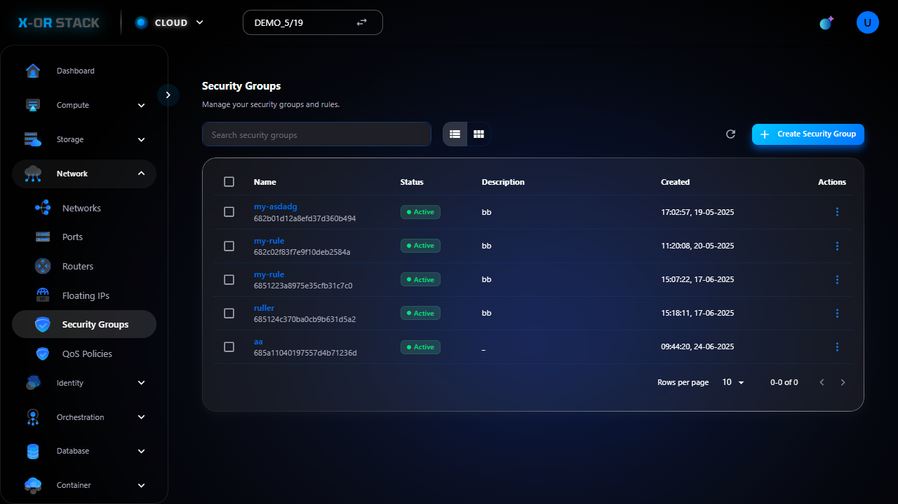

# Quản lý Security Groups (Nhóm bảo mật)

## Giới thiệu
**Security Groups** là tập hợp các luật firewall dùng để giới hạn truy cập vào instance (VD: cho phép SSH, HTTP...).

## Các bước thao tác

### 1. Truy cập Security Groups
- Từ menu chính chọn `Network > Security Groups`.
- Giao diện hiển thị danh sách các nhóm bảo mật.

### 2. Tạo Security Group mới
- Nhấn `Create Security Group`.
- Nhập tên, mô tả → Bấm `Create`.

### 3. Thêm luật cho Security Group
- Click vào Security Group → Tab `Rules`.
- Nhấn `Add Rule` → Chọn loại:
  - Ví dụ: **Ingress - TCP - 22 - 0.0.0.0/0** (cho phép SSH)
- Bấm `Add`.

## Ghi chú
- Cần mở đúng cổng để máy ảo có thể SSH, HTTP hoặc HTTPS.
- Có thể tạo nhiều Security Group và gán cho từng Instance.

## Đường dẫn thao tác
`https://portal.stack-dev.x-or.cloud/network/security_groups`