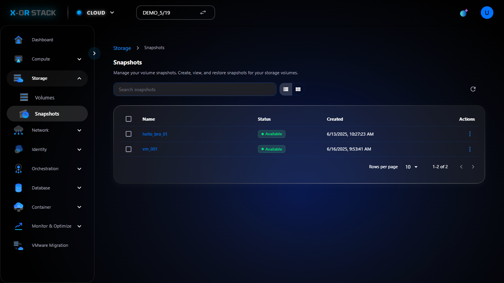

# Quản lý Snapshots (Sao lưu Volume)

## Giới thiệu
Chức năng **Snapshots** trong module **Storage** cho phép người dùng tạo bản sao lưu (snapshot) của các ổ đĩa (volume) để khôi phục khi cần.

## Các bước thao tác

### 1. Truy cập Snapshots
- Từ menu chính chọn `Storage > Snapshots`.
- Giao diện sẽ hiển thị danh sách snapshot đang có.

## Lưu ý
- Snapshot chỉ tạo được khi volume không bị lock hoặc đang ở trạng thái phù hợp.
- Có thể dùng snapshot để tạo volume mới.

## Đường dẫn thao tác
`https://portal.stack-dev.x-or.cloud/storage/snapshots`