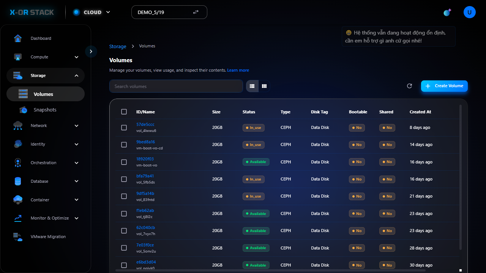

# Quản lý Volumes (Ổ đĩa lưu trữ)

## Giới thiệu
Chức năng **Volumes** trong module **Storage** cho phép người dùng tạo, chỉnh sửa, gắn kết và xóa các ổ đĩa lưu trữ (volume) cho các máy ảo (instance).

## Các bước thao tác

### 1. Truy cập Volumes
- Từ menu chính chọn `Storage > Volumes`.
- Giao diện sẽ hiển thị danh sách các volumes đang có.

### 2. Tạo mới Volume
- Bấm nút `Create Volume`.
- Nhập thông tin:
  - **Name**: Tên volume
  - **Size (GB)**: Dung lượng ổ đĩa
  - **Description** (tuỳ chọn)
  - **Availability Zone**: Vùng khả dụng
- Bấm `Create` để hoàn tất.

## Lưu ý
- Volume đang được gắn vào Instance thì không thể xóa.
- Có thể tạo snapshot từ volume để sao lưu.

## Đường dẫn thao tác
`https://portal.stack-dev.x-or.cloud/storage/volumes`